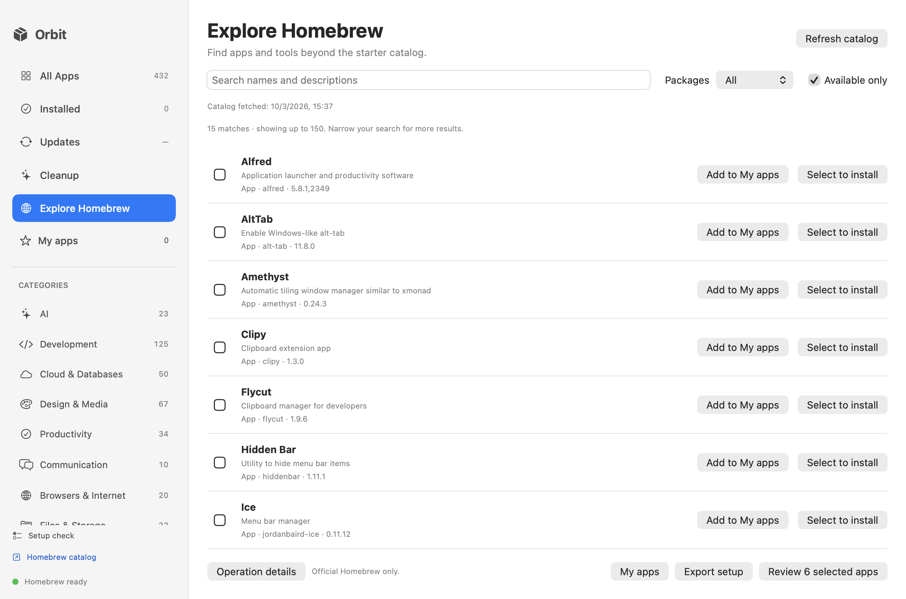

# Orbit

**Set up your Mac. Manage your apps. Clear the clutter.**

A native macOS app for discovering, installing, updating, and uninstalling Homebrew packages—with reviewed cleanup and reusable Brewfiles. Pick the apps you want, review the plan, and let Homebrew handle the installation.


## One place for your Mac apps

| What you need | What Orbit does |
| --- | --- |
| Set up a new Mac | Browse 432 curated entries, use starter selections, and install the missing apps you choose. |
| Find something new | Search the official Homebrew catalog in **Explore Homebrew** and save favorites in **My apps**. |
| Manage existing apps | See Homebrew-managed and manually installed apps; review supported apps for Homebrew adoption. |
| Keep apps current | Check available updates and upgrade only your selected packages. |
| Remove an app | Review removal and optionally select app-specific leftovers to move to Trash. |
| Review clutter | Inspect caches, logs, and optional developer caches before moving selected items to Trash. |
| Reuse your setup | Import or export a Brewfile with a separate selection that can include installed apps. |

## Discover apps beyond the starter list

Search official Homebrew formulas and casks by name or description. **Add to My apps** saves a favorite; **Select to install** adds it to a reviewed installation plan. Only the packages you choose become direct Brewfile entries; dependencies are handled by Homebrew.



## Review cleanup before changing anything

Cleanup has its own page in the main window. Scan supported locations, inspect paths and estimated sizes, then choose what to move to Trash. Nothing is selected by default. Large files in Downloads and Desktop can be revealed in Finder for your own review.


Cleanup does not empty Trash or promise to remove every trace of an application. App-specific settings and data are reviewed separately through **Uninstall & Clean**.

*Screenshots use demonstration data rendered by the app. No real installation or cleanup was performed to create them.*

## Get started

Requires **macOS 14 or later**. Homebrew must be installed to perform package operations; the first-launch setup check links to the official setup guide when it is missing. You can browse before completing setup.

To build from source, install Apple Command Line Tools, clone this repository, then run:

```sh
git clone https://github.com/CNRNYK/orbit.git
cd orbit
bash build.sh
open "dist/Orbit.app"
```

The repository is currently private, so cloning requires access. Builds target your Mac's architecture. Local builds use ad-hoc signing; a notarized public installer and a Homebrew cask for Orbit are not currently published.

## You choose the changes

- Installation, updates, removal, and adoption have review steps before execution.
- Installed apps cannot accidentally join a new installation selection.
- Cleanup moves selected, validated paths to Trash; it does not automatically delete personal files.
- Homebrew runs as your user. Individual vendor installers may request administrator permission through the bundled native password dialog.
- **Operation details** shows progress and errors; **Stop after current app** lets the current operation finish.

App licenses, subscriptions, and vendor sign-in are separate. Orbit does not restore application settings or install App Store products.

## More details

- [Feature behavior, permissions, and cleanup scope](docs/FEATURES.md)
- [Catalog mapping and unavailable entries](CATALOG-NOTES.md)
- [Install Homebrew](https://brew.sh)
- [Homebrew documentation](https://docs.brew.sh/Manpage)

For automated validation, run `bash test.sh`. Tests use simulated commands and temporary fixtures; they do not install or remove your applications.

## License

[MIT](LICENSE) for the source code. Third-party apps, icons, and trademarks retain their respective owners' terms. Orbit is independent of Homebrew and application vendors.
