# Orbit

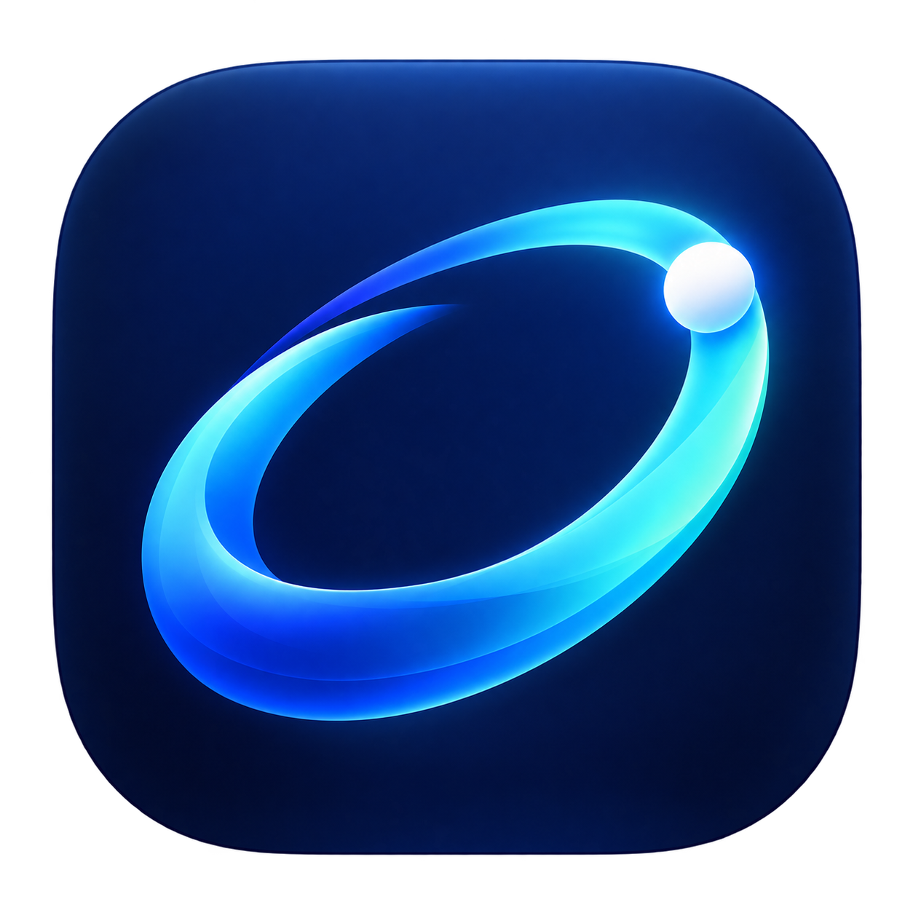

**Set up your Mac. Manage your apps. Record your workflow.**

**Early-access beta** · [Product page](https://towlar.com/en/products/orbit/) · [Report a bug](https://github.com/CNRNYK/orbit/issues/new/choose) · [Contribute](CONTRIBUTING.md)

A native macOS app for discovering, installing, updating, and uninstalling Homebrew packages—with reviewed cleanup, reusable Brewfiles and local screen recording. Pick the apps you want, review the plan, and let Homebrew handle the installation.

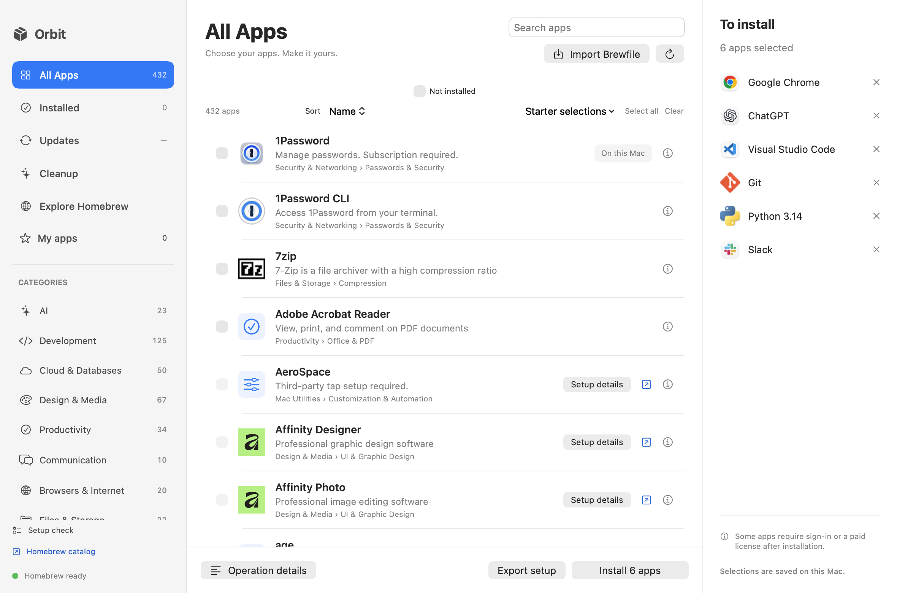

## One place for your Mac apps

| What you need | What Orbit does |
| --- | --- |
| Set up a new Mac | Browse 432 curated entries, use starter selections, and install the missing apps you choose. |
| Find something new | Search the official Homebrew catalog in **Homebrew Center → Discover** and save favorites in **Library**. |
| Manage existing apps | See Homebrew-managed and manually installed apps; review supported apps for Homebrew adoption. |
| Keep apps current | Check available updates and upgrade only your selected packages. |
| Remove an app | Review removal and optionally select app-specific leftovers to move to Trash. |
| Review clutter | Inspect caches, logs, and optional developer caches before moving selected items to Trash. |
| Prepare your terminal | Choose Zsh essentials and language environments, review changes, and apply with private backups. |
| Check permissions | Use Setup Center for requirements, optional permissions and Orbit startup. |
| Diagnose app setup | Run App Health Check for Homebrew, missing dependencies and known managed app bundles. |
| Manage startup apps | Review standard Open at Login apps; configure Orbit startup in Setup Center. |
| Capture and explain | Record with live annotations or edit a screenshot locally in Screenshot Studio. |
| Reuse your setup | Import or export a Brewfile with a separate selection that can include installed apps. |

## Homebrew Center

**Discover · Library · Updates** — three tabs for the complete app workflow.

- **Discover:** one search, recommended apps first and additional official Homebrew matches below. Duplicate packages appear once. With no query, browse the curated starter catalog.
- **Library:** installed and saved apps together, with **All / Installed / Saved** filters. Homebrew-managed apps, manual apps and saved favorites have clear status labels. Save or unsave without installing or uninstalling.
- **Updates:** choose exactly which available updates to install, then review the plan.

**To install** stays visible across all three tabs. Installation and removal choices stay separate. Your install plan survives switching tabs or reopening Orbit.

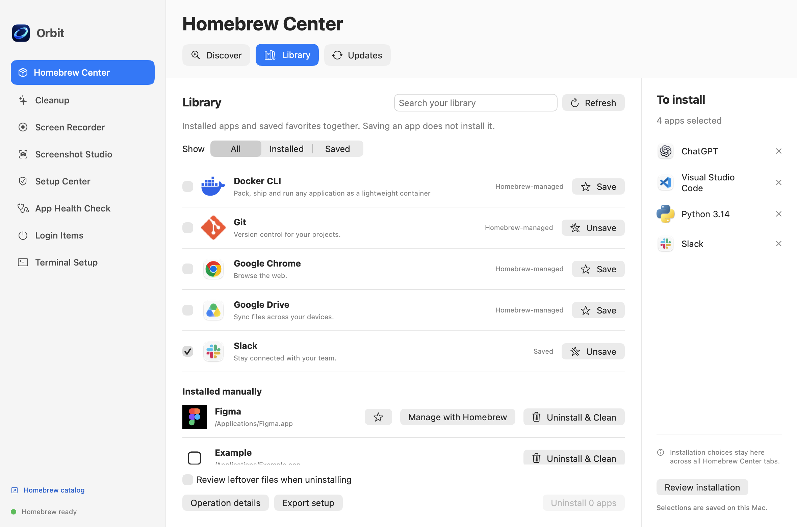

Manually installed apps offer **Manage with Homebrew** when a supported match exists, or **Uninstall & Clean**. Removal first reviews the app and exact matching leftover paths, leaves personal data unchecked, rechecks app identity and Homebrew ownership, and moves selected items to Trash. Running apps must be closed first. Shared vendor folders are excluded; Orbit does not promise to find every leftover.

## Review cleanup before changing anything

Cleanup has its own page in the main window. Scan supported locations, inspect paths and estimated sizes, then choose what to move to Trash. Nothing is selected by default. Select a group or all cleanable items explicitly; personal large files remain outside bulk cleanup. Large files in Downloads and Desktop can be revealed in Finder for your own review.

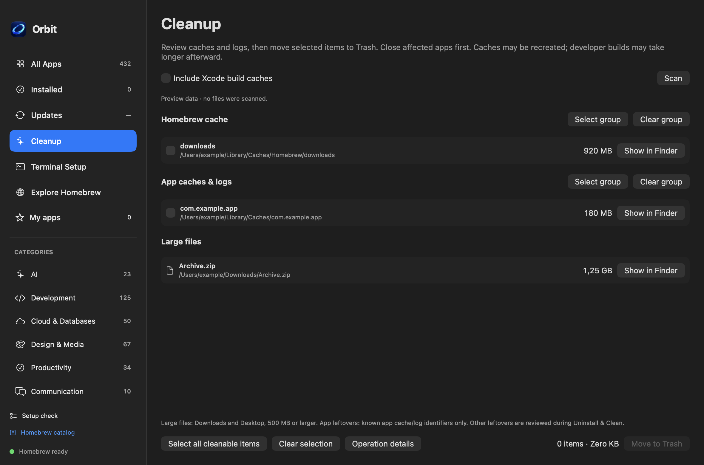

Cleanup does not empty Trash or promise to remove every trace of an application. App-specific settings and data are reviewed separately through **Uninstall & Clean**.

*Screenshots use demonstration data rendered by the app. No real installation or cleanup was performed to create them.*

## Prepare your developer terminal

**Terminal Setup** offers checkbox selections for Homebrew, completion, history, aliases, and optional Node/NVM, Python + uv, Java 21, Go, Rustup, and Ruby/rbenv environments. Starship, fzf, suggestions, and highlighting are optional.

Scan your existing Zsh profiles, review Orbit's proposed blocks, then apply. Existing content is preserved, changes are backed up, and repeating the same selection does not duplicate settings. Missing tools join the ordinary install selection; profile changes never install software. Restore is blocked if you edited a profile after applying it.

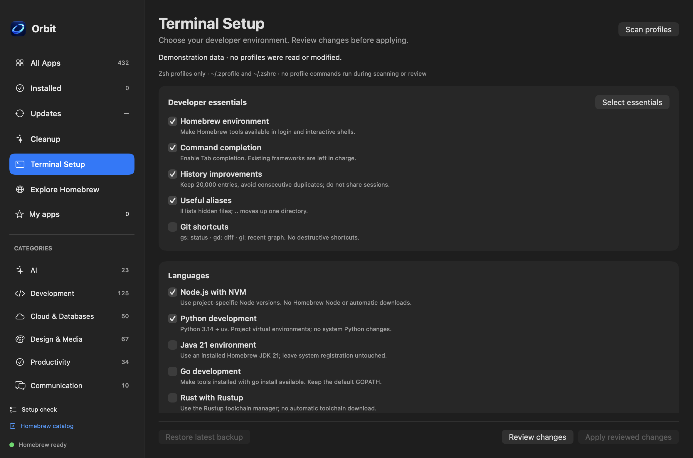

## Record what matters

Record a full display, a selected rectangle or a single window from **Screen Recorder** or Orbit's menu bar panel. Start recording directly from the menu without bringing the main window forward; floating controls provide pause and stop. Recordings start without a filename dialog and save automatically to your selected folder (Movies/Orbit Recordings by default). Add a colored mouse halo, click rings, optional cursor-follow zoom, shortcut labels and a webcam bubble. Microphone and system audio have separate switches and start off.

A three-second countdown gives you time to prepare. Pause or stop from the floating controls or menu bar; Orbit's own windows are excluded from the video. Add blur areas or solid privacy covers before recording. The recorder has **Record**, **Edit** and **Settings** tabs. When saving finishes, Orbit opens Edit. Drag the start/end handles on one thumbnail timeline and see the corresponding frame as you move. Choose **Keep selected range** or **Remove selected range**, preview the result, then **Save edited copy** while retaining the original. Open existing videos and adjust either handle frame by frame. Recordings stay local; no account or upload is involved.

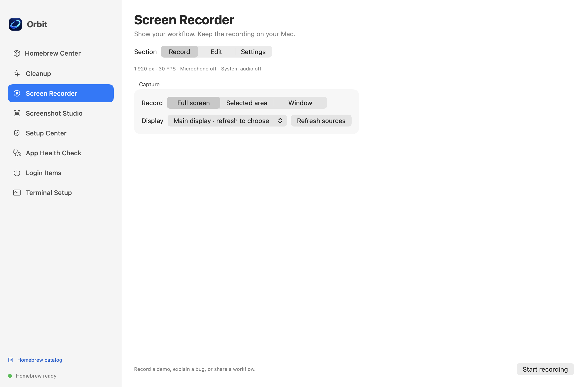

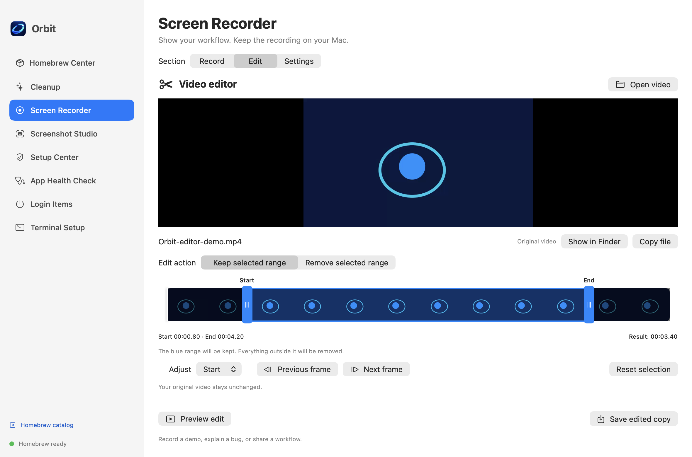

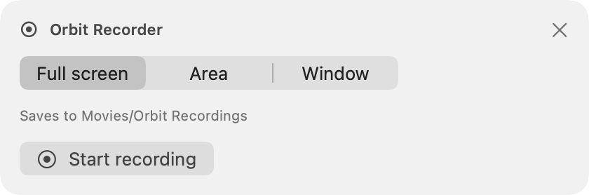

## Capture, annotate and check your Mac

**Screenshot Studio** captures a display, window or selected area, including directly from the menu bar. Capture first, then Orbit opens the editor. Draw arrows, rectangles, freehand lines, highlights or text; use Blur or an opaque Cover for selected regions. Undo and Clear let you revise edits, then copy or save the flattened PNG. Saved files do not overwrite an existing file. Blur can leave recognizable detail; use Cover for secrets and check the exported result before sharing.

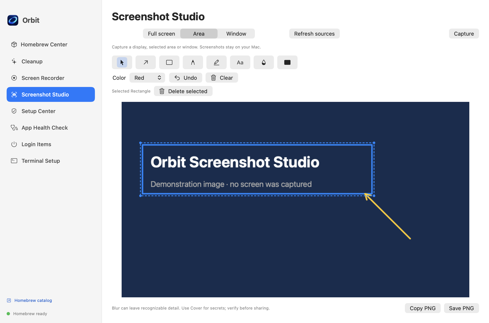

During recording, a thin red border marks the captured region, including a moving window. The border and floating controls are excluded from capture. Enable **Draw on recording** to add arrows, rectangles, pen strokes, highlights and text to the saved video. Drawing intercepts clicks inside the region; switch it off to interact with your apps. Annotations are applied before the recording's privacy masks and zoom.

**Setup Center → Permissions** shows Orbit's screen, microphone, camera, input monitoring, accessibility and System Events access. First-launch setup uses the same Requirements, Permissions and Startup sections; installation review also exposes access status. Optional permissions do not block setup. Passive checks do not open permission prompts; explicit Request or Verify buttons do. Screen access is verified with ScreenCaptureKit rather than a legacy permission hint. macOS can require reopening Orbit after a permission change. Installed applications request their own access; Orbit cannot grant it on their behalf.

**App Health Check** runs diagnostic Homebrew commands and checks Orbit's packaged helper and known app bundles. Results do not run repairs or remove files. A missing app in the standard Applications folders may be in a custom location and needs review.

**Setup Center → Startup** controls Orbit at login. **Login Items** automatically loads standard Open at Login applications when System Events access is already allowed; otherwise it offers an explicit Allow access action. Add application opens Applications, and removing an item requires confirmation. Removing a login item does not uninstall the app. Other background services stay in the native macOS Login Items settings.

## Orbit, one click away

Orbit lives in the macOS menu bar with a small monochrome orbit icon. Open its compact panel to start a screen recording, check available updates, jump to Cleanup or review operation details. During app operations it shows the current app, processed and remaining counts, and **Stop after current app**.

Closing the main window keeps Orbit in the menu bar. **Open Orbit** or its Dock icon brings the same window back; **Quit Orbit** exits. Active operations must finish before quitting. Update checks run on request; installing, updating and cleaning still use the normal reviewed flows.

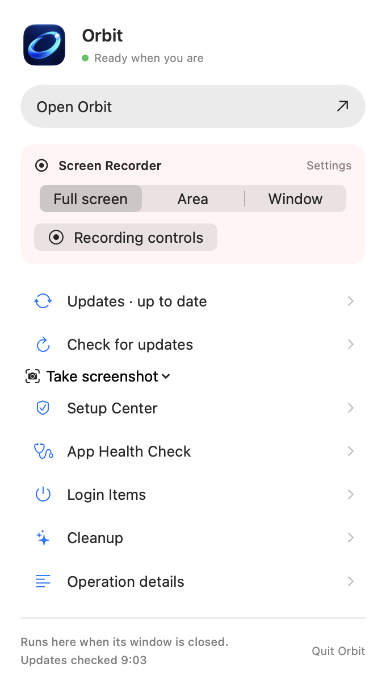

## Get started

Requires **macOS 14 or later**. Homebrew must be installed to perform package operations; the first-launch setup check links to the official setup guide when it is missing. You can browse before completing setup.

**[Download Orbit for Apple Silicon (.dmg)](https://github.com/CNRNYK/orbit/releases/download/v0.20.1/Orbit-0.20.1-macOS-arm64.dmg)** · [Release notes](https://github.com/CNRNYK/orbit/releases/tag/v0.20.1)

Open the DMG and drag **Orbit.app** to **Applications**. While the repository is private, downloads require repository access. This release is ad-hoc signed and has not been notarized, so macOS may require approval in Privacy & Security. Only approve a download you trust.

To build from source, install Apple Command Line Tools, clone this repository, then run:

```sh
git clone https://github.com/CNRNYK/orbit.git
cd orbit
bash build.sh
open "dist/Orbit.app"
```

While the repository is private, cloning requires access. Builds target your Mac's architecture. Local builds use ad-hoc signing; a notarized public installer and a Homebrew cask for Orbit are not currently published. The DMG is distributed through GitHub Releases.

## Beta status and support

The published DMG currently targets Apple Silicon. Source builds target the current Mac architecture; Intel distribution has not been validated. Recordings, permission changes, multiple displays and vendor installers should be checked on the installed build. Generated media tests do not replace those device checks.

The release is ad-hoc signed and not notarized. macOS may require approval or reauthorization for a new installed copy. Orbit's release check links to GitHub; it does not silently replace the app. Cleanup does not guarantee removal of every leftover, and a missing bundle in standard folders can be valid in a custom location.

Use the [bug and feature request forms](https://github.com/CNRNYK/orbit/issues/new/choose). Review [data handling](docs/PRIVACY.md) before sharing logs and [SECURITY.md](SECURITY.md) for suspected vulnerabilities.

## You choose the changes

- Installation, updates, removal, and adoption have review steps before execution.
- Installed apps cannot accidentally join a new installation selection.
- Cleanup moves selected, validated paths to Trash; it does not automatically delete personal files.
- Homebrew runs as your user. Individual vendor installers may request administrator permission through the bundled native password dialog.
- **Operation details** shows progress and errors; **Stop after current app** lets the current operation finish.

App licenses, subscriptions, and vendor sign-in are separate. Orbit does not restore application settings or install App Store products.

## Built to evolve

Source and tests are organized by feature. Read the [architecture](docs/ARCHITECTURE.md), [development with AI guide](docs/AI-DEVELOPMENT.md), [test guide](docs/TESTING.md), [release checklist](docs/RELEASING.md), [changelog](docs/CHANGELOG.md) and [idea map](docs/ROADMAP.md).

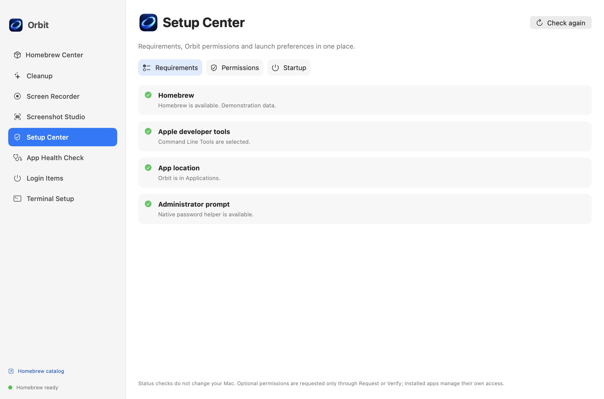

## More details

- [Feature behavior, permissions, and cleanup scope](docs/FEATURES.md)
- [Data handling](docs/PRIVACY.md) and [asset provenance](docs/ASSETS.md)
- [Catalog mapping and unavailable entries](docs/CATALOG.md)
- [Install Homebrew](https://brew.sh)
- [Homebrew documentation](https://docs.brew.sh/Manpage)

To package a local build as a DMG, run `bash package-dmg.sh` after building. The script creates a compressed image with Orbit, an Applications shortcut, installation notes, and a SHA-256 checksum.

For automated validation, run `bash test.sh`. Tests use simulated commands and temporary fixtures; they do not install or remove your applications.

## License

[MIT](LICENSE) for the source code. Third-party apps, icons, and trademarks retain their respective owners' terms. Orbit is independent of Homebrew and application vendors.

Closing the main window hides Orbit from the Dock while keeping its menu bar controls and operations running. **Open Orbit** restores the window and Dock icon; **Quit Orbit** exits. Configure this behavior in **Setup Center → Startup**.
