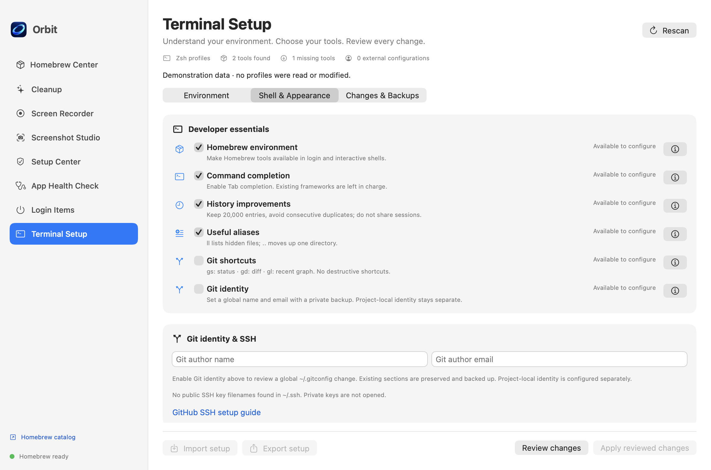
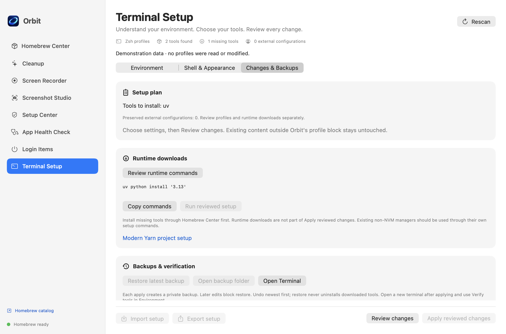

# Terminal Setup

Terminal Setup has three tabs: **Environment**, **Shell & Appearance**, and **Changes & Backups**. Discovery runs automatically on entry. Rescan updates it without installing software or executing profiles.

## Environment

Orbit reads home-directory `.zprofile`, `.zshrc`, `.zshenv` and `.zlogin`. Configuration references are labeled **Configured outside Orbit**, not “installed.” Details identify files and approximate reference lines without showing their contents. Linked profiles, active custom ZDOTDIR, invalid markers and unsupported files block profile changes.

Executable discovery checks common Homebrew, user, NVM, Cargo and system paths. Multiple NVM versions may exist: the displayed candidate is not a claim about the active version in an interactive terminal. **Verify tools** explicitly runs discovered executables with version arguments, a limited environment and a five-second deadline per command. System Java/Ruby launchers are not invoked. Unknown or failing versions remain visible. No user profile is sourced. The user's shell may have additional paths not covered by discovery.

Starter selections: Minimal, Web Development, Python Development, QA & Automation. Existing Orbit-managed selections are retained so a preset does not silently remove custom setup. External configurations remain in control.

- Node uses NVM integration; Node version is LTS or a numeric version. npm comes with Node. Existing non-NVM managers remain untouched.
- Python uses `uv`, a selectable numeric Python version and project-local `ov` / `oa` helpers. Orbit does not install Homebrew Python as a requirement, replace Apple's Python or automatically activate environments.
- Java offers Homebrew JDK 17, 21 or 25. It sets JAVA_HOME for the selected JDK without system registration.
- Go retains default GOPATH. Rust integrates Rustup. Ruby integrates rbenv. Runtime downloads and activation choices are separate from profile integration.
- Optional pnpm or Yarn uses the selected Node/npm environment. No Homebrew Node/Corepack is added indirectly. Yarn 1 uses its Classic npm package; newer numeric versions and latest use the official @yarnpkg/cli-dist distribution. Project Yarn configuration remains untouched.

**Review missing tools in Homebrew Center** fetches official metadata and adds only missing direct tools to the existing reviewed installation selection. It does not install from Terminal Setup. Homebrew NVM is disclosed as unsupported by upstream; existing official NVM installations are also recognized.

**Choose project folder** reads `.nvmrc`, `.node-version`, `.python-version`, `package.json`, relevant `pyproject.toml` lines and lockfile names. Numeric pins and package-manager versions can be copied into choices. Ranges and custom specifications remain informational. Reading metadata never runs package scripts, activates environments or changes project files.

## Shell & Appearance

Essentials include Homebrew integration, completion, history and aliases. Optional shell tools include Starship, fzf, suggestions, highlighting, zoxide and bat/ripgrep/fd/eza. Standard commands are not automatically aliased to replacements. Highlighting loads last in the Orbit block.

Git identity is an explicit global `.gitconfig` change prepared on a temporary copy. Other sections are preserved. Project-local identity is available as copyable, quoted commands and is not run automatically. Git conditional includes and project configuration may override a global identity. SSH discovery lists only public-key filenames; private keys are not read and authentication is not claimed to be verified.

Custom aliases have validated names and single-line commands. Existing alias/function names outside Orbit block conflicting changes. Alias definitions are quoted, so their command substitutions do not execute during review or profile loading. Their bodies execute when the alias is invoked. Review commands before applying.

Minimal, Developer and Compact themes have an illustrative terminal preview. Applying a theme requires Orbit's Starship integration and writes `.orbit-starship.toml`; the user's original Starship configuration file is preserved. The environment variable is set before initializing Starship. Nerd Font selection remains in the terminal application's own settings.

## Changes & Backups

**Review changes** prepares the exact file changes and performs syntax-only validation. The UI shows old/new Orbit profile blocks, the Git identity replacement and the generated theme. Unrelated Git config and user profile contents are not exposed in the review.

**Apply reviewed changes** writes only the reviewed files. It checks snapshots again and creates a private backup receipt first. It never installs tools or downloads runtimes. Profile files, Git configuration and the Orbit theme all participate in stale-file, link, size and permission protection. A partial failure retains the backup and attempts rollback of unchanged replacements.

**Review runtime commands** is separate. Download checkboxes are independent of profile integration choices, so an existing NVM can be used without replacing its shell configuration. The displayed script can download selected Node/Python/Rust/Ruby versions and install a selected global package manager. Running requires the separate **Run reviewed setup** confirmation. It runs Zsh with `-f`, not the user's profiles; NVM is explicitly loaded when selected. Missing managers fail rather than trigger an unreviewed bootstrap. Ruby installation does not select a global Ruby version. Successful downloads remain installed if later commands fail, and restoring profiles does not uninstall them. Runtime downloads are not scheduled or started by opening the page.

The backup list shows dates and allows inspection. **Restore latest backup** restores the newest successful file change and moves its receipt out of the active stack. Undo older changes by repeating newest-first. Any post-apply content or permission edit blocks restoration; manual backup copies remain available. Open a new terminal after applying or restoring.

**Export setup** includes profile choices, runtime download choices and versions, excludes Git identity, custom aliases, profiles, paths, history and SSH keys. **Import setup** validates its format and options, preserves external configurations and only prepares choices for review. Imported custom alias commands, if present in an independently authored file, are visible for review and are never executed by importing.

Preferences remain local. Test and demonstration stores do not persist configuration. Tests use isolated temporary homes, project fixtures and fake runtime commands, never the user's actual profiles or installations.

## Upstream references

- [NVM installation and usage](https://github.com/nvm-sh/nvm)
- [uv Python management](https://docs.astral.sh/uv/guides/install-python/)
- [Starship configuration](https://starship.rs/config/)
- [Yarn official npm distribution script](https://github.com/yarnpkg/berry/blob/master/scripts/release/03-release-npm.sh)

## Interface previews

These are demonstration fixtures; no real profiles or developer tools were changed for the screenshots.

